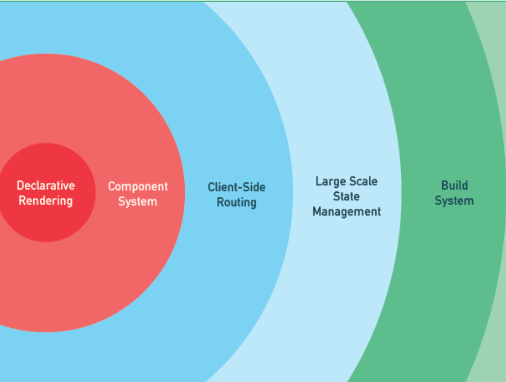
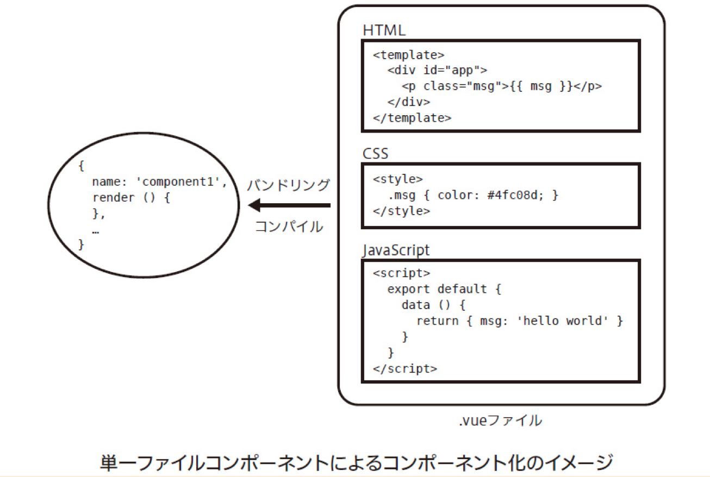
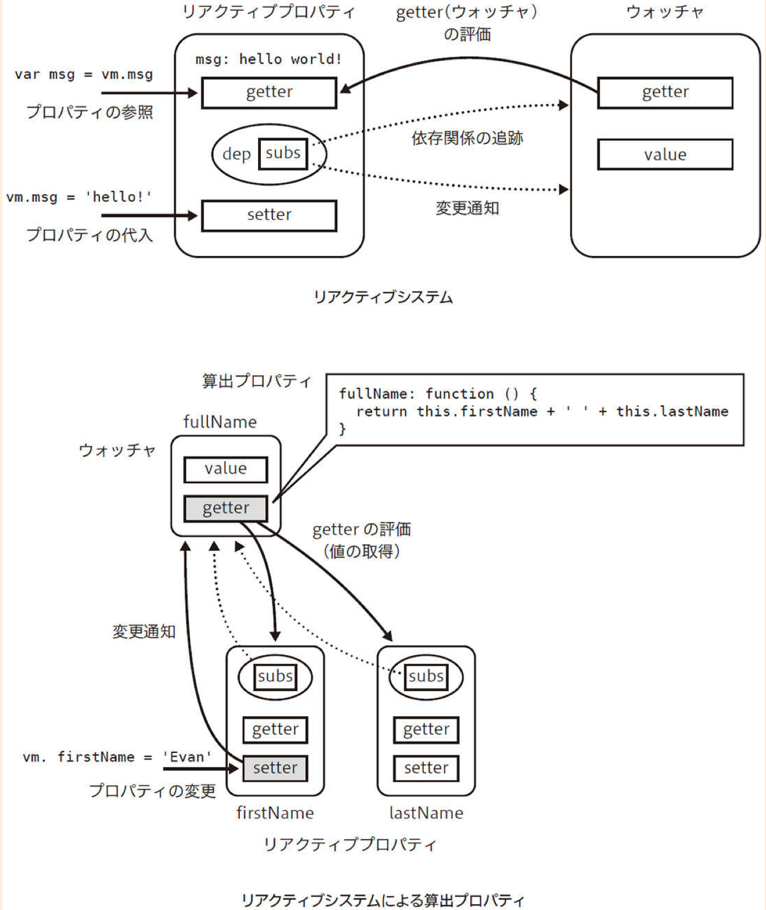
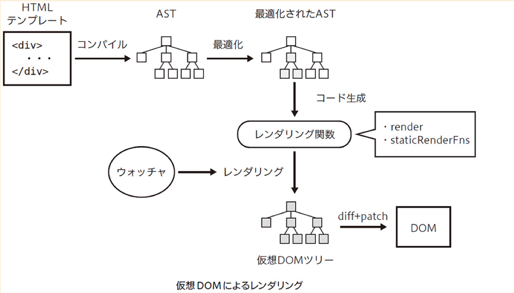

## このレッスンの目標

- Vue.js の設計思想を理解する
- プログレッシブフレームワークの概念を理解する
- Vue.js を支える技術を理解する

## Vue.js とは

Vue.js（ビュージェイエス）は、ビュー（View）層に特化したライブラリです。

実際のユーザーの目に見える領域、例えば Web ページ内のウィジェットや管理画面のダッシュボードといったインタラクティブなコンテンツをうまく取り扱うことができます。

さらに、関連するライブラリなどと組み合わせると、包括的なフレームワークとして扱うことも可能で、大規模アプリケーションの開発にも適用できるようになっています。

また、MVVM と呼ばれる設計パターンを採用しているのも Vue.js の特徴になります。

- [参考：Vue.js ではじめる MVVM 入門](https://design.dena.com/engineering/vue-js%E3%81%A7%E3%81%AF%E3%81%98%E3%82%81%E3%82%8Bmvvm%E5%85%A5%E9%96%80)

## Vue.js の設計思想

Vue.js の根底にある思想には、プログレッシブフレームワーク（Progressive Framework）という考え方があり、Vue.js の作者である Evan You 氏は、以下のことを提唱しています。

> フレームワークはどんなときにでも、どんな規模でも、段階的に柔軟に使えるべきである。

設計思想はそのまま、他のフレームワークとの違いにも関連してくるため、Vue.js の公式サイトで公開されている以下の記事も参考にしてください。

- [他のフレームワークとの比較 - vue.js](https://jp.vuejs.org/v2/guide/comparison.html)

## プログレッシブフレームワークの解決する段階的な領域

それでは、プログレッシブフレームワークの解決する段階的な領域についてみていきましょう。

以下のイメージは、Vue.js 作者の Evan You 氏が作成したスライド資料からの引用です。



- [引用：The Progressive Framework - 本家資料](https://docs.google.com/presentation/d/1WnYsxRMiNEArT3xz7xXHdKeH1C-jT92VxmptghJb5Es/edit?usp=sharing)

### 1.宣言的レンダリング（Declarative Rendering）

プログレッシブフレームワークが解決する１つ目の領域は、宣言的な DOM レンダリングに関するものです。

HTML テンプレートにレンダリングする対象を宣言的に記載することで、データ変更のたびにリアクティブな DOM レンダリングと、ユーザーによる入力データの同期が可能になります。

この領域は、Vue.js 本体がサポートしています。

ランディングページのようなシンプルな Web サイトはじめ、小規模なウィジェットなどがこの領域の対象になります。

### 2.コンポーネントシステム（Component System）

２つ目は、UI をモジュール化して再利用する必要がある領域です。

この領域もコンポーネント化する機能がある Vue.js 本体が担当します。

複数のコンポーネントを配置する Web サイトや複数のウィジェットを作成するようなケースが該当します。イメージとしては、宣言的レンダリングで解決できる範囲よりも、やや複雑な領域になります。

### 3.クライアントサイドルーティング（Client-side Routing）

３つ目は、Web サイトがシングルページアプリケーションとして動作するときに必要とされる、Web アプリケーションの領域です。

ルーティングとは簡単に言えばアプリケーションの URL 設計、指示のようなものです。Vue.js が公式で提供しているルーティングライブラリ Vue Router を利用すれば、これまでに作成したコンポーネントでシングルページアプリケーションに対応可能になります。

### 4.大規模向け状態管理（Large-scale State Management）

４つ目は、コンポーネント間で状態の共有方法が必要となる領域です。

Vue.js が公式で提供しているデータフローアーキテクチャに沿った状態管理ライブラリ Vuex を利用することによってこの領域の問題を解決できます。既存のコンポーネントを拡張する形で状態を集中管理することが可能になります。

### 5.ビルドシステム（Build System）

最後５つ目は、Web アプリケーションのコンポーネントの管理、本番環境への配信、そしてプロジェクト構成について考える必要がある領域です。

Vue.js が公式で提供している開発サポートツールを利用して、この領域の問題を解決できます。これにより、プロジェクトの環境構築や構成管理に余計な手間をかけずに継続的な開発を持続できるようになります。

シングルページアプリケーションの開発が本格化したケースなどが考えられます。

以上５つの領域が、プログレッシブフレームワークの解決する段階的な領域でした。

Vue.js は、Evan You 氏が提唱する `フレームワークはどんなときにでも、どんな規模でも、段階的に柔軟に使えるべきである` という思想を体現しているため、ごく小規模な段階から、本格的な大規模アプリケーションの開発にまで応用できるフレームワークとなっています。

## Vue.js を支える技術

それでは次に、Vue.js の思想を支える技術についても見ていきましょう。

Vue.js では、アプリケーションのパフォーマンスや開発の利便性を高めるために重要な３つの技術的なバックグラウンドがあります。

### 1.コンポーネントシステム

Vue.js はコンポーネントを容易に扱えるライブラリです。大きなシステムはコンポーネントに区切って開発することで、それぞれの関心事を絞り、スムーズに開発できます。

そして、コンポーネントシステムの中でも特に重要な仕組みが、単一ファイルコンポーネントです。Vue.js は、この仕組によって HTML ライクなコンポーネントを単一のファイルに書けるようになっています。

単一ファイルコンポーネントは `.vue` という独自の拡張子を用います。



- [引用：Vue.js 入門 基礎から実践アプリケーション開発まで - 書籍](https://www.amazon.co.jp/gp/product/B07J6FP6NQ?ref_=kcp_mac_dp)

Vue.js のコンポーネントは、従来の Web 標準の技術構成（HTML、CSS、JavaScript）にならった形で定義できるため、非常に学習コストが低いことも特徴に上げられます。

下記のように、メッセージを返すだけのコンポーネントを 1 つのファイルにまとめて書けます。

```
<template>
  <p>{{ message }}!</p>
</template>

<script>
exportdefault = {
  data() {
    return {
      message: "こんにちは",
    };
  },
};
</script>

<style scoped>
p {
  color: red;
}
</style>
```

コンポーネントで大事なのは、それを機能や関心事という言語の役割とは別の粒度で切り出せることであり、このように、単一のファイルにコンポーネントを書けるのは非常に強力な仕組みです。

### 2.リアクティブシステム

Vue.js のリアクティブシステムは、オブザーバーパターンをベースに実装されています。

- [参考：デザインパターン「Observer」 - Qiita](https://qiita.com/shoheiyokoyama/items/d4b844ed29f84a80795b)

平たく言えば、状態の変化を Vue.js が検知（監視）して、自動的に DOM 側に反映できるようにする仕組みです。

リアクティブシステムは、コンポーネントのレンダリングの骨格となります。高度な DOM 操作を必要とするアプリケーションでは、データバインディングはとても有用です。

また、変更検知だけでなく、値の依存関係に伴う更新など DOM を操作する上で欠かせない部分を開発者が意識することなく処理してくれます。

こういった仕組みを持たないライブラリだと、変更と同時に各所を変更させたり、変更がどの箇所に影響を与えるか分からないままプログラミングをする場当たり的なつくりになりがちです。

後ほど学習していく算出プロパティなどは、リアクティブシステムの恩恵を受けた例になります。

算出プロパティとは、値の変更を検知して自動的に更新できるプロパティのことです。これは、Vue.js でテンプレートを書くときは欠かせません。（次のレッスンで詳しく解説します）



- [引用：Vue.js 入門 基礎から実践アプリケーション開発まで - 書籍](https://www.amazon.co.jp/gp/product/B07J6FP6NQ?ref_=kcp_mac_dp)

リアクティブシステムは上図のように、リアクティブプロパティとウォッチャ（Watcher）のセットによって実現します。

このように、算出プロパティやコンポーネントのレンダリングは、ウォッチャ内部のゲッターをうまく利用して、効率よく実現していることを覚えておきましょう。

### 3.レンダリングシステム

Vue.js は仮想 DOM（Virtual-DOM）による DOM の高速なレンダリングを提供しています。

仮想 DOM とは DOM 操作を簡略化、高速化するための技術です。より高速で使いやすい DOM の代替を作成してそれを操作し、実際の DOM に反映させます。

以下の図は Vue.js が実際に仮想 DOM を処理するときの流れになります。



- [引用：Vue.js 入門 基礎から実践アプリケーション開発まで - 書籍](https://www.amazon.co.jp/gp/product/B07J6FP6NQ?ref_=kcp_mac_dp)

【処理フロー解説】

1. Vue.js のコンパイラは、テンプレートをコンパイルした際に生成された AST（Abstract Syntax Tree：テンプレートなどをプログラム上で扱いやすくしたデータ構造）に対して最適化を行います。この最適化では、仮想 DOM によるレンダリング処理のパフォーマンスを向上させるために、静的なノードとノードツリーを検出して AST に対してマーキングします。
1. その後、このマーキングにより最適化された AST を元に、リアクティブプロパティを元にしたレンダリングを行う render 関数と、静的なレンダリングを行う staticRenderFns 関数を生成します。
1. 生成されたこれらの関数を実行し、仮想 DOM ツリーを生成し、仮想 DOM の diff、patch 処理によって、実際に DOM 要素が生成されてレンダリングされます。
1. 初回のレンダリング以降は、Vue.js が持つリアクティブシステムと組み合わせてレンダリングすることで、リアクティブプロパティの変更のたびレンダリングすることによってコンポーネントの表示内容を更新します。

Vue.js を支える技術の解説は以上です。

- コンポーネントシステム
- リアクティブシステム
- レンダリングシステム

上記 3 つの概要を把握していると、これから Vue.js を学ぶ上でも役立つ知識となるので、ぜひ何度か読み返しながら理解を深めていきましょう。

## まとめ

Vue.js の導入に関するレッスンはこれで終了となります。

このレッスンでは、

1. Vue.js の設計思想
1. プログレッシブフレームワークの概念
1. Vue.js を支える技術

以上の 3 点を学習しました。

まずは、Vue.js の設計思想を事前に知っておくことで、簡易的に Vue.js を導入する方法や、本格的に Vue.js のプロジェクトを作成する方法など、その違いを理解する助けになります。

Vue.js はプログレッシブなフレームワークですので、まずは局所的に Vue.js を活用する方法を学び、徐々に本格的なアプリケーション開発に適用させていく流れを学んでいきましょう！

<hr>

[次のレッスンに進む >>](02_Vue.jsの基本.md)
