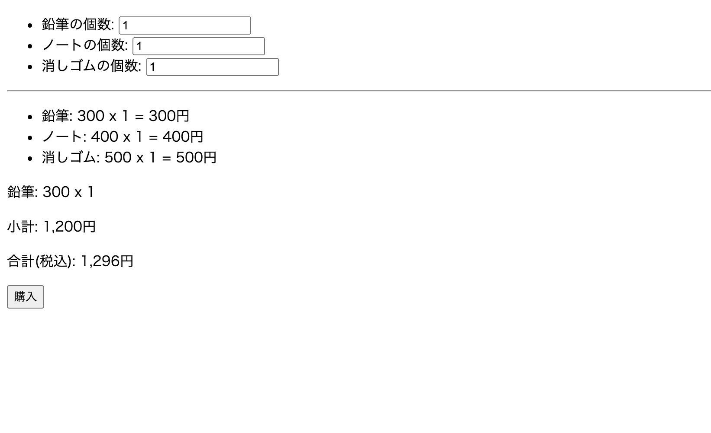
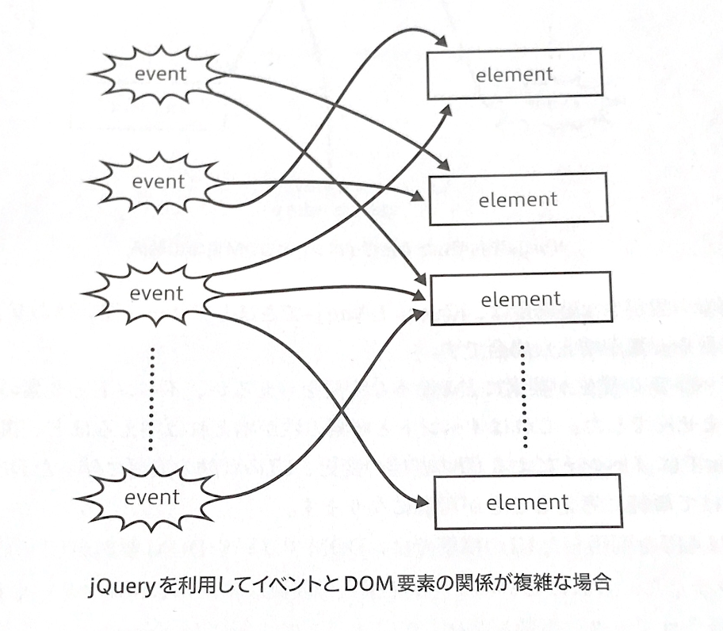
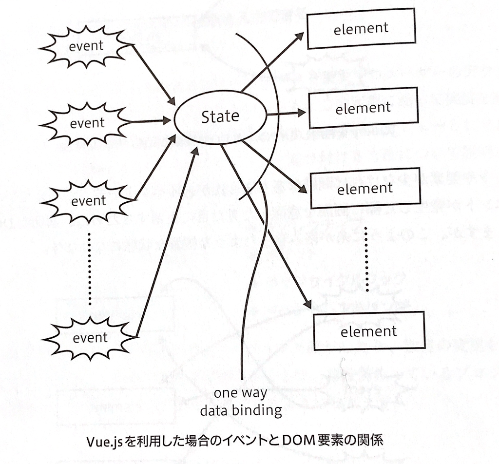

## このレッスンの目標

- Vue.js を使った簡易的なフォーム作成の開発スキルを習得する
- Vue.js の基本となる Vue オブジェクトについて理解する
- Vue オブジェクトが提供する API や機能を理解する

このレッスンでは、簡単なフォーム作成を通して、Vue.js で UI を構築する際の考え方や基本的な機能の扱い方を習得していきます。

## このレッスンで作るもの

このレッスンでは、以下のような「文房具の購入フォーム」を Vue.js で作成していきます。

### フォームの仕様

- 鉛筆、ノート、消しゴムのそれぞれの購入個数を入力できる
- 合計が 1000 円以上で購入が可能になる

UI は、`データ` とそのデータを画面に表示する `ビュー`、データを変更するユーザーの `アクション` の 3 つから成り立っています。

このレッスンで作成するサンプルアプリケーションも、この定義に沿って実装を進めていきます。

最初にアプリケーションで扱うデータを定義し、その次にデータをビューとしてどのように見せるかを検討します。最後に、ユーザーのアクションを受け付ける方法を理解しながら、購入フォームを完成させていきます。

### このレッスンで扱う機能

- データ
- テンプレート記法
- フィルタ
- 算出プロパティ
- ディレクティブ
- メソッド
- ライフサイクル
- イベントハンドリング

## Vue.js と従来型の UI 構築の違い

Vue.js の基本機能を学ぶ前に、Vue.js で UI 構築する際の考え方を確認しておきましょう。

以下の図は、jQuery で UI 実装したときに直面する問題点を表しています。

- [引用：Vue.js 入門 基礎から実践アプリケーション開発まで - 書籍](https://www.amazon.co.jp/gp/product/B07J6FP6NQ?ref_=kcp_mac_dp)

jQuery では、ボタンなどの DOM 要素にイベントが発生したときに呼ばれる関数（イベントリスナー）を登録して、その関数が自身や他の DOM 要素を操作することで UI を実現しています。

しかし、イベントや要素が増えていくにつれて、上図のように糸が絡み合うように複雑な状態で DOM を操作していく必要が出てきます。

これが従来の UI 構築における主な問題点でした。

### Vue.js の UI 構築

Vue.js は、従来型の UI 構築における問題を以下のように解決しています。

- [引用：Vue.js 入門 基礎から実践アプリケーション開発まで - 書籍](https://www.amazon.co.jp/gp/product/B07J6FP6NQ?ref_=kcp_mac_dp)

上図のように、イベントと要素の間に「UI の状態（state）」を挟むことにより、イベントと DOM 要素の関係が複雑になることを回避しています。

Vue.js では、① イベントによる UI の状態の変更、②UI の状態の変更に伴った DOM ツリーや DOM 要素の更新の 2 つに分けてシンプルに考えることが可能になります。

さらに、Vue.js では以下の視点を切り替えながら UI 構築を進めていきます。

1. その UI の持つ状態は何か、JavaScript のオブジェクトとしてどう表現できるか
1. データバインディングによって UI の状態と DOM ツリーをどうマッピングするか
1. イベントによってどの状態を変更にするか

そのため、Vue.js では常に UI の状態を担う JavaScript のオブジェクトを中心に UI 構築を捉えます。

これは、従来型の UI 構築と大きく変わった、Vue.js 独自のコーディングスタイルです。

この UI 構築の考え方が理解できると、Vue.js でコーディングする流れもスムーズに理解できるかと思います。

## Vue.js の導入

## Vue オブジェクト

## Vue インスタンスのマウント

## UI のデータ定義（data）

## テンプレート構文

## フィルタ（filters）

## 算出プロパティ（computed）

## ディレクティブ

## ライフサイクルフック

## メソッド（methods）
