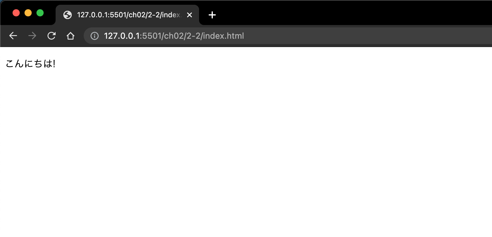

## このレッスンの目標

- Vue.js を使った簡易的なフォーム作成の開発スキルを習得する
- Vue.js の基本となる Vue オブジェクトについて理解する
- Vue オブジェクトが提供する API や機能を理解する

このレッスンでは、簡単なフォーム作成を通して、Vue.js で UI を構築する際の考え方や基本的な機能の扱い方を習得していきます。

## このレッスンで作るもの

このレッスンでは、以下のような「文房具の購入フォーム」を Vue.js で作成していきます。


### フォームの仕様

- 鉛筆、ノート、消しゴムのそれぞれの購入個数を入力できる
- 合計が 1000 円以上で購入が可能になる

UI は、`データ` とそのデータを画面に表示する `ビュー`、データを変更するユーザーの `アクション` の 3 つから成り立っています。

このレッスンで作成するサンプルアプリケーションも、この定義に沿って実装を進めていきます。

最初にアプリケーションで扱うデータを定義し、その次にデータをビューとしてどのように見せるかを検討します。最後に、ユーザーのアクションを受け付ける方法を理解しながら、購入フォームを完成させていきます。

### このレッスンで扱う機能

- データ
- テンプレート記法
- フィルタ
- 算出プロパティ
- ディレクティブ
- メソッド
- ライフサイクル
- イベントハンドリング

## Vue.js と従来型の UI 構築の違い

Vue.js の基本機能を学ぶ前に、Vue.js で UI 構築する際の考え方を確認しておきましょう。

以下の図は、jQuery で UI 実装したときに直面する問題点を表しています。


- [引用：Vue.js 入門 基礎から実践アプリケーション開発まで - 書籍](https://www.amazon.co.jp/gp/product/B07J6FP6NQ?ref_=kcp_mac_dp)

jQuery では、ボタンなどの DOM 要素にイベントが発生したときに呼ばれる関数（イベントリスナー）を登録して、その関数が自身や他の DOM 要素を操作することで UI を実現しています。

しかし、イベントや要素が増えていくにつれて、上図のように糸が絡み合うように複雑な状態で DOM を操作していく必要が出てきます。

これが従来の UI 構築における主な問題点でした。

### Vue.js の UI 構築

Vue.js は、従来型の UI 構築における問題を以下のように解決しています。


- [引用：Vue.js 入門 基礎から実践アプリケーション開発まで - 書籍](https://www.amazon.co.jp/gp/product/B07J6FP6NQ?ref_=kcp_mac_dp)

上図のように、イベントと要素の間に「UI の状態（state）」を挟むことにより、イベントと DOM 要素の関係が複雑になることを回避しています。

Vue.js では、① イベントによる UI の状態の変更、②UI の状態の変更に伴った DOM ツリーや DOM 要素の更新の 2 つに分けてシンプルに考えることが可能になります。

さらに、Vue.js では以下の視点を切り替えながら UI 構築を進めていきます。

1. その UI の持つ状態は何か、JavaScript のオブジェクトとしてどう表現できるか
1. データバインディングによって UI の状態と DOM ツリーをどうマッピングするか
1. イベントによってどの状態を変更にするか

そのため、Vue.js では常に UI の状態を担う JavaScript のオブジェクトを中心に UI 構築を捉えます。

これは、従来型の UI 構築と大きく変わった、Vue.js 独自のコーディングスタイルです。

この UI 構築の考え方が理解できると、Vue.js でコーディングする流れもスムーズに理解できるかと思います。

【参考サイト】

- [Vue.js と jQuery の違いは メリット・デメリットを歴史的に比較](https://runteq.jp/blog/programming-school/knowledge/2774/)
- [jQuery から Vue.js へのステップアップ - Qiita](https://qiita.com/mio3io/items/e7b2596d06b8005e8e6f)

## Vue.js の導入

ここからは実際に手を動かしならが学んでいきます。

Vue.js の一番簡単な導入方法は、script 要素で直接読み込むやり方です。最新バージョンが CDN の https://unpkg.com/vue という URL で配信されています。

今回はバージョンが指定された https://unpkg.com/vue@2.5.17 という URL を利用します。以下のように script 要素で読み込むだけで、Vue.js の導入が完了します。

読み込んだ後は、グローバル変数 Vue が定義され、ここから Vue.js の機能を利用できます。

```
<!DOCTYPE html>
<html lang="ja">

<head>
    <meta charset="UTF-8">
    <meta name="viewport" content="width=device-width, initial-scale=1.0">
    <meta http-equiv="X-UA-Compatible" content="ie=edge">
    <script src="https://unpkg.com/vue@2.5.17"></script>
</head>

<body>
    <div id="app">
        <p>
            {{ message }}
        </p>
    </div>
    <script>
        // ロードされ、Vueがグローバル変数として定義されているか確認
        console.assert(typeof Vue !== 'undefined');
        new Vue({
            el: '#app',
            data: {
                message: 'こんにちは!'
            }
        });
    </script>
</body>

</html>
```

### TODO：

- 任意の場所に `index.html` ファイルを作成する
- `index.html` ファイルに上記のコードを実装する
- 表示結果を確認して、画面に「こんにちは！」と表示されることを確認する

### 結果：



### 解説：

まずは、上記の TODO に取り組み表示結果を確認してみましょう。

画面に「こんにちは！」と表示されていれば、Vue.js の導入が完了しています。

ここでは、Vue.js の核の機能であるデータバインディングに注目してください。

```
new Vue({
    el: '#app',
    data: {
        message: 'こんにちは!'
    }
});
```

このコードは、Vue インスタンスを生成して以下のことを行っています。

- `el: '#app'` で Vue インスタンス をマウントする要素を指定
- `data: {}` で UI のデータを定義（オブジェクト形式で保持する）

後ほど細かく解説しますので、現状では Vue インスタンスが保持しているデータオブジェクトが、DOM 要素に反映（データバインディング）されていることが確認できれば OK です。

## Vue オブジェクト

本セクション以降は Vue.js の API や基本機能を紹介していきます。

script 要素で Vue.js のファイルを読み込んだことで、グローバル変数 Vue が定義されます。

グローバル変数 Vue は、Vue.js の動作の根幹となる重要な変数（オブジェクト）となっており、以下の役割を持っています。

- コンストラクタの役割
- Vue.js の API を束ねる名前空間（モジュール）

### 公式リファレンスを確認しよう

グローバル変数 Vue にあるオプションや API の詳細は、公式リファレンスに纏まっています。

学習初期に全てのリファレンスを参照するのは理解の妨げになりますので、Vue に慣れた段階で確認する流れがオススメです。

以下は、Vue.js のバージョン 2.x 系の公式リファレンスになります。重要度の高い内容とそれ以外で整理しましたので、まずは必読のセクションから確認してみましょう。

【必読：Vue.js の核となる機能】

- [グローバル API](https://jp.vuejs.org/v2/api/#%E3%82%B0%E3%83%AD%E3%83%BC%E3%83%90%E3%83%AB-API)
- [オプション / データ](https://jp.vuejs.org/v2/api/#%E3%82%AA%E3%83%97%E3%82%B7%E3%83%A7%E3%83%B3-%E3%83%87%E3%83%BC%E3%82%BF)
- [オプション / DOM](https://jp.vuejs.org/v2/api/#%E3%82%AA%E3%83%97%E3%82%B7%E3%83%A7%E3%83%B3-DOM)
- [オプション / ライフサイクルフック](https://jp.vuejs.org/v2/api/#%E3%82%AA%E3%83%97%E3%82%B7%E3%83%A7%E3%83%B3-%E3%83%A9%E3%82%A4%E3%83%95%E3%82%B5%E3%82%A4%E3%82%AF%E3%83%AB%E3%83%95%E3%83%83%E3%82%AF)
- [ディレクティブ](https://jp.vuejs.org/v2/api/#%E3%83%87%E3%82%A3%E3%83%AC%E3%82%AF%E3%83%86%E3%82%A3%E3%83%96)

【参考までに知っておく内容】

- [グローバル設定](https://jp.vuejs.org/v2/api/#%E3%82%B0%E3%83%AD%E3%83%BC%E3%83%90%E3%83%AB%E8%A8%AD%E5%AE%9A)
- [オプション / アセット](https://jp.vuejs.org/v2/api/#%E3%82%AA%E3%83%97%E3%82%B7%E3%83%A7%E3%83%B3-%E3%82%A2%E3%82%BB%E3%83%83%E3%83%88)
- [オプション / 構成](https://jp.vuejs.org/v2/api/#%E3%82%AA%E3%83%97%E3%82%B7%E3%83%A7%E3%83%B3-%E6%A7%8B%E6%88%90)
- [オプション / その他](https://jp.vuejs.org/v2/api/#%E3%82%AA%E3%83%97%E3%82%B7%E3%83%A7%E3%83%B3-%E3%81%9D%E3%81%AE%E4%BB%96)
- [インスタンスプロパティ](https://jp.vuejs.org/v2/api/#%E3%82%A4%E3%83%B3%E3%82%B9%E3%82%BF%E3%83%B3%E3%82%B9%E3%83%97%E3%83%AD%E3%83%91%E3%83%86%E3%82%A3)
- [インスタンスメソッド / データ](https://jp.vuejs.org/v2/api/#%E3%82%A4%E3%83%B3%E3%82%B9%E3%82%BF%E3%83%B3%E3%82%B9%E3%83%A1%E3%82%BD%E3%83%83%E3%83%89-%E3%83%87%E3%83%BC%E3%82%BF)
- [インスタンスメソッド / イベント](https://jp.vuejs.org/v2/api/#%E3%82%A4%E3%83%B3%E3%82%B9%E3%82%BF%E3%83%B3%E3%82%B9%E3%83%A1%E3%82%BD%E3%83%83%E3%83%89-%E3%82%A4%E3%83%99%E3%83%B3%E3%83%88)
- [インスタンスメソッド / ライフサイクル](https://jp.vuejs.org/v2/api/#%E3%82%A4%E3%83%B3%E3%82%B9%E3%82%BF%E3%83%B3%E3%82%B9%E3%83%A1%E3%82%BD%E3%83%83%E3%83%89-%E3%83%A9%E3%82%A4%E3%83%95%E3%82%B5%E3%82%A4%E3%82%AF%E3%83%AB)
- [特別な属性](https://jp.vuejs.org/v2/api/#%E7%89%B9%E5%88%A5%E3%81%AA%E5%B1%9E%E6%80%A7)
- [組み込みコンポーネント](https://jp.vuejs.org/v2/api/#%E7%B5%84%E3%81%BF%E8%BE%BC%E3%81%BF%E3%82%B3%E3%83%B3%E3%83%9D%E3%83%BC%E3%83%8D%E3%83%B3%E3%83%88)

## Vue インスタンスのマウント

## UI のデータ定義（data）

## テンプレート構文

## フィルタ（filters）

## 算出プロパティ（computed）

## ディレクティブ

## ライフサイクルフック

## メソッド（methods）
